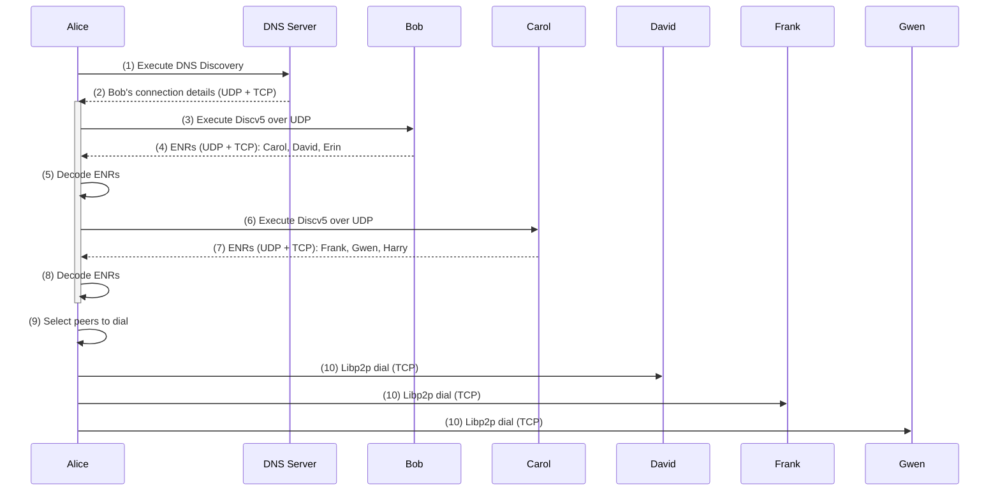

1. DNS Discovery protocol is executed.
2. Alice retrieves Bob's ENR (Ethereum Node Record) from DNS Server.
3. Alice executes the Discv5 protocol with Bob using UDP connection details from ENR.
4. Bob returns Carol's, David's and Erin's ENRs to Alice.
5. Alice decodes ENRs and extracts the details of Carol, David, and Erin's TCP and UDP connections.
6. Alice executes the Discv5 protocol with Carol using UDP connection details from ENR.
7. Carol returns Frank's, Gwen's and Harry's ENRs to Alice.
8. Alice decodes ENRs and extracts Frank's, Gwen's and Harry's TCP and UDP connection details.
9. Alice selects to dial David, Frank and Gwen.
10. Alice dials David, Frank and Gwen over libp2p using TCP connection details from ENRs.