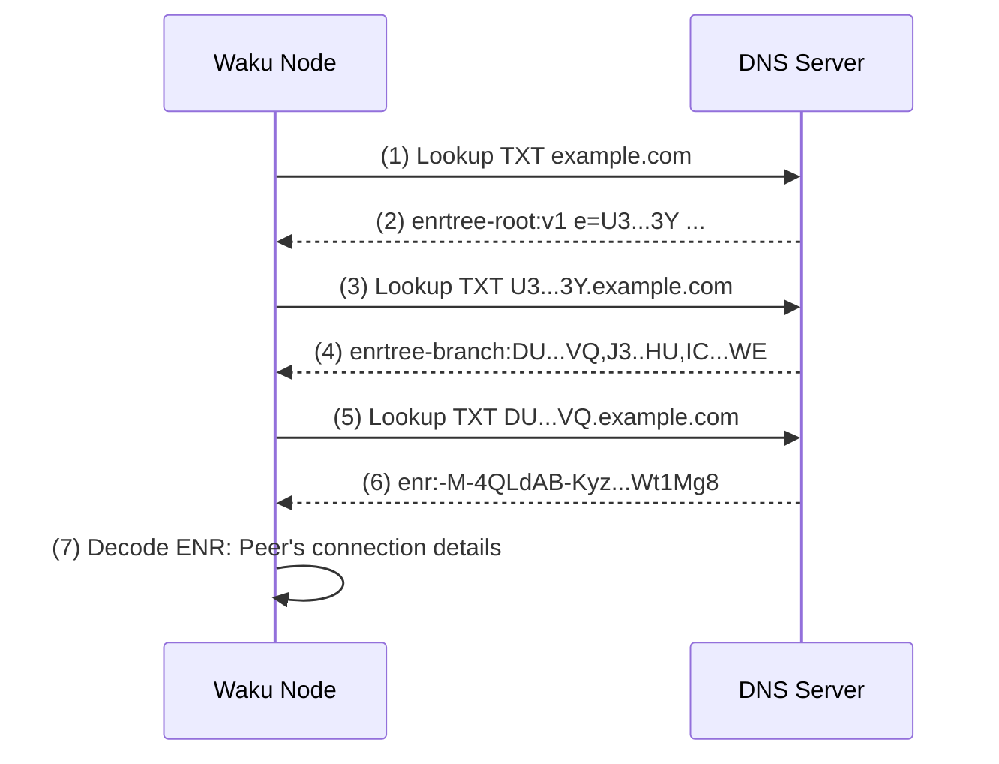

1. DNS lookup query to retrieve TXT data stored on `example.com` domain.
2. `entree-root` is returned, value of `e` is the `enr-root`, root hash of the node subtree.
3. DNS lookup query to retrieve TXT data stored on `<enr-root>.example.com` domain.
4. `entree-branch` is returned, this tree contains hashes of node subtrees.
5. DNS lookup query to retrieve TXT data stored on, `DU...VQ.example.com` domain,  the first leaf of `entree-branch`.
6. `enr` record is returned.
7. Returned value is decoded, peer connection details such as ip address and port are learned.
