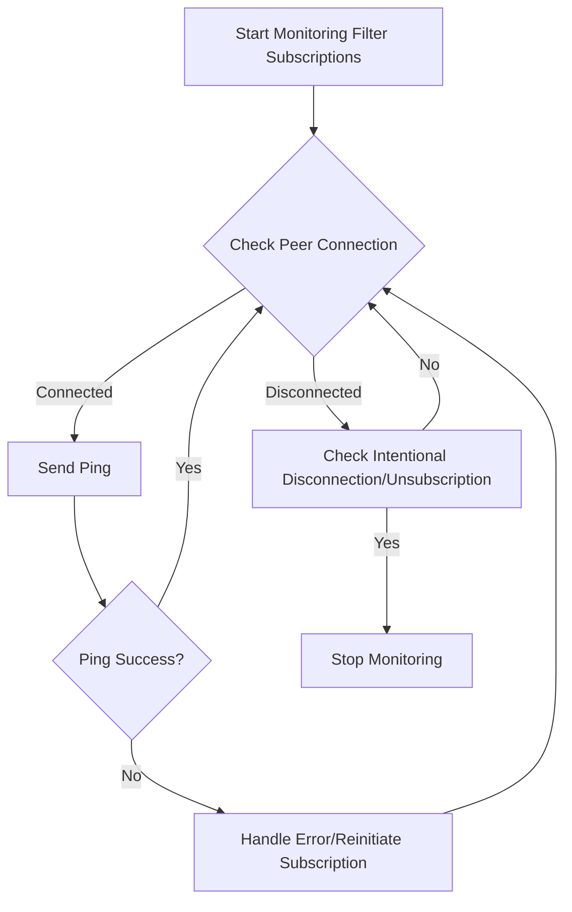

```mermaid
graph TD
    A[Start Monitoring Filter Subscriptions] --> B{Check Peer Connection}
    B -- Connected --> C[Send Ping]
    C --> D{Ping Success?}
    D -- Yes --> B
    D -- No --> E[Handle Error/Reinitiate Subscription]
    B -- Disconnected --> F[Check Intentional Disconnection/Unsubscription]
    F -- Yes --> G[Stop Monitoring]
    F -- No --> B
    E --> B
```