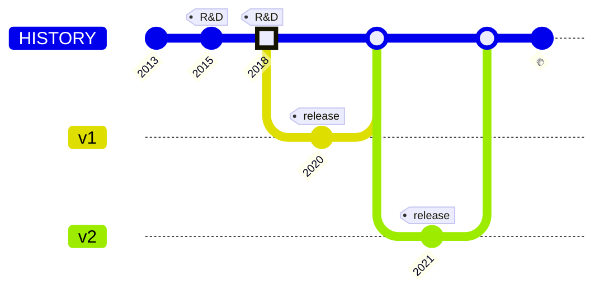

```mermaid
%%{init: { 'gitGraph': {'showBranches': true, 'showCommitLabel': true, 'mainBranchName': 'HISTORY'}} }%%
gitGraph
	commit id:"2013"
    commit id:"2015" tag:"R&D"
    commit id:"2018" tag:"R&D" type: HIGHLIGHT
    branch v1
    checkout v1
    commit id:"2020" tag:"release"
    checkout HISTORY
    merge v1
    branch v2
    checkout v2
    commit id:"2021" tag:"release"
    checkout HISTORY
    merge v2
    commit id:"🔥"
```