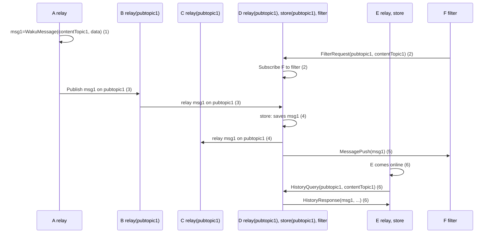

The Pub/Sub topic `pubtopic1` serves as a means of routing messages (the network employs a default Pub/Sub topic) and indicates that it is subscribed to messages on that topic for a relay. Node D serves as a `Store` and is responsible for persisting messages.

1. Node A creates a WakuMessage `msg1` with [Content Topic](/learn/concepts/content-topics) `contentTopic1`.
2. Node F requests to get messages filtered by Pub/Sub topic `pubtopic1` and Content Topic `contentTopic1`. Node D subscribes F to this filter and will forward messages that match that filter in the future.
3. Node A publishes `msg1` on `pubtopic1`. The message is sent from Node A to Node B and then forwarded to Node D.
4. Node D, upon receiving `msg1`, stores the message for future retrieval by other nodes and forwards it to Node C.
5. Node D also pushes `msg1` to Node F, informing it about the arrival of a new message.
6. At a later time, Node E comes online and requests messages matching `pubtopic1` and `contentTopic1` from Node D. Node D responds with `msg1` and potentially other messages that match the query.