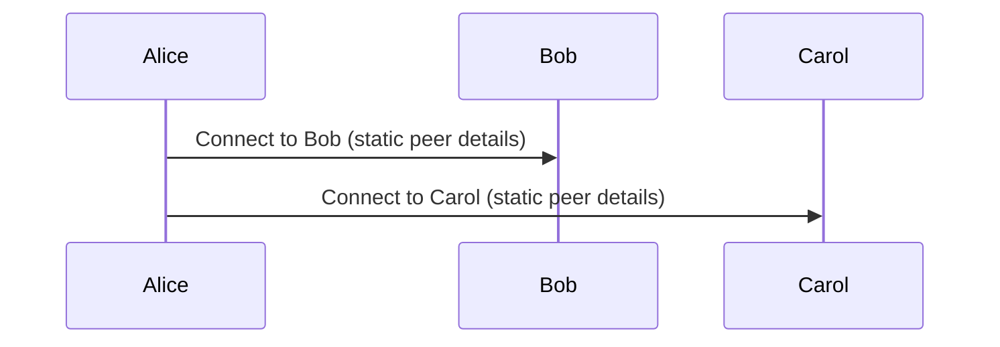

```mermaid
sequenceDiagram
Alice->>Bob: Connect to Bob (static peer details)
Alice->>Carol: Connect to Carol (static peer details)
```

Alice establishes connections with Bob and Carol using their node details, which are predefined (hard-coded) into Alice's node.