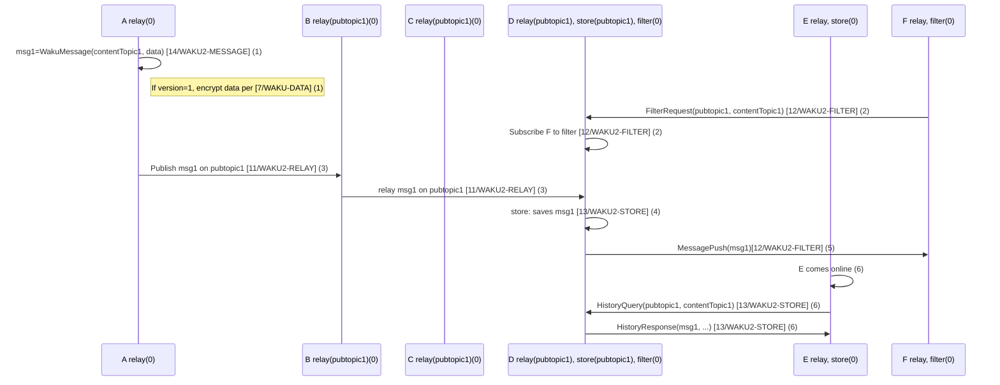

We have six nodes, A-F.

The protocols initially mounted are indicated as such.

The PubSub topic `pubtopic1` is used for routing (the network uses a default pubsub topic) and indicates that it is subscribed to messages on that topic for relay.Ditto for Waku Store where it indicates that these messages are persisted on that node.

1. Node A creates a WakuMessage `msg1` with a ContentTopic `/my-dapp/0/notifications/proto`.

2. Node F requests to get messages filtered by PubSub topic `pubtopic1` and ContentTopic `contentTopic1`. Node D subscribes F to this filter and will in the future forward messages that match that filter.

3. Node A publishes `msg1` on `pubtopic1` and subscribes to that relay topic pick it up. It then gets relayed further from B to D, but not C since it doesn't subscribe to that topic.

4. Node D saves `msg1` for possible later retrieval by other nodes.

5. Node D also pushes `msg1` to F, as it has previously subscribed F to this filter.

6. At a later time, Node E comes online. It then requests messages matching `pubtopic1` and `contentTopic1` from Node D. Node D responds with messages meeting this (and possibly other) criteria.
