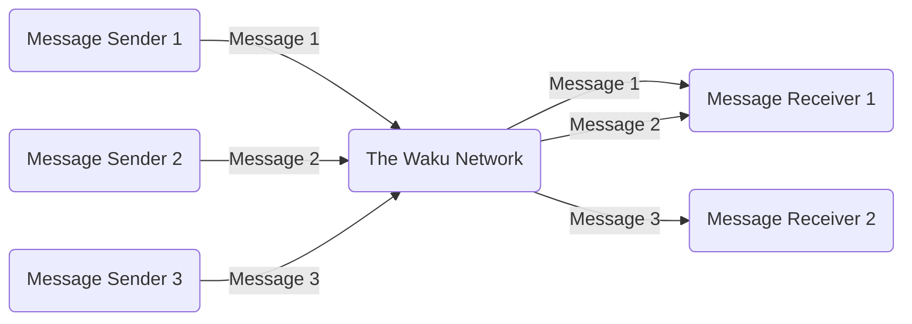

Waku is a family of robust, censorship-resistant, peer-to-peer communication protocols that enable privacy-focused messaging for Web3 applications, allowing you to integrate decentralised communication features into your dApp without compromising security or privacy.

  <iframe class="yt-video" src="https://www.youtube.com/embed/nIWx5Vp_Qxk" title="Waku Tutorial 001: Introduction to Waku" frameborder="0" allow="accelerometer; autoplay; clipboard-write; encrypted-media; gyroscope; picture-in-picture; web-share" allowfullscreen></iframe>

:::tip
Check out our [Learn section](/learn/waku-network), [YouTube channel](https://www.youtube.com/@wakuorg), and [Blog](https://blog.waku.org/) to dive into how Waku works behind the scenes!
:::

## What isn’t Waku?

- Waku is not a blockchain but a network composed of protocols designed for Web3 communication, operating without the need for gas fees.
- Waku is not just for messaging applications; it supports the development of complex applications that require secure and private data transmission.
- Waku is not a long-term data storage network; it focuses on short, ephemeral, real-time messaging.

## What can Waku be used for?

1. **Chat Messengers**: Waku can be used to build private, decentralised chat apps resistant to censorship.
2. **Voting and Proposals**: Exchange votes on proposals off-chain via Waku to save gas fees, then submit aggregated results to the blockchain.
3. **NFT Marketplaces**: Use Waku to handle off-chain NFT bids and offers for gas savings, and to integrate social interactions like likes and comments.
4. **State Channels**: Establish and maintain state channels with Waku, facilitating seamless message exchanges and updates without blockchain interaction.
5. **Signature Exchange for Multi-Signature Wallets**: Allow multi-signature wallet owners to exchange signatures privately and securely through Waku.
6. **Game Mechanics Communication**: Implement Waku as a communication layer for decentralised, peer-to-peer gaming, avoiding centralised infrastructure.
7. **Layer 2 Coordination (Open Market, Spam Protected Mempool)**: Broadcast and aggregate Layer 2 transactions via Waku to enhance privacy and scalability, reducing network load.
8. **Social Media Platforms**: Beyond chat messengers, use Waku for decentralised, censorship-resistant social media platforms like news feeds and multimedia sharing.

:::tip
Looking for what to build with Waku? Discover a collection of sample ideas and use cases for inspiration, curated by our community at: https://ideas.waku.org/ and [Awesome Waku](https://github.com/waku-org/awesome-waku/).
:::

## Use cases

## Get started

### Run a Waku node

Waku is a decentralised, permissionless system where anyone can run a node, use the network, and contribute to its support. We recommend following the [Run Nwaku with Docker Compose](/guides/nwaku/run-docker-compose) guide and [Waku Node Operator Cheatsheet](/Waku-NodeOperator.pdf) to easily run a node.

  <iframe class="yt-video" src="https://www.youtube.com/embed/fs0ynLk4z0I" title="How to run a Waku node using Nwaku Compose" frameborder="0" allow="accelerometer; autoplay; clipboard-write; encrypted-media; gyroscope; picture-in-picture; web-share" allowfullscreen></iframe>

:::tip
If you encounter issues running your node or require assistance with anything, please visit the [#node-help channel](https://discord.com/channels/1110799176264056863/1216748184592711691) on our Discord.
:::

### Integrate using SDKs

Waku is implemented in multiple SDKs, allowing it to integrate with different languages and address various use cases efficiently.

|                                                          | Description                                                                         | Documentation                                                         |
| -------------------------------------------------------- | ----------------------------------------------------------------------------------- | --------------------------------------------------------------------- |
| [@waku/sdk](https://github.com/waku-org/js-waku)         | JavaScript/TypeScript SDK designed for browser environments                         | [JavaScript Waku SDK](/guides/js-waku/)                               |
| [@waku/react](https://www.npmjs.com/package/@waku/react) | React components and UI adapters designed for seamless integration with `@waku/sdk` | [Build React DApps Using @waku/react](/guides/js-waku/use-waku-react) |

### Other integrations

|                                                                    | Description                                                                            | Documentation                                                                |
| ------------------------------------------------------------------ | -------------------------------------------------------------------------------------- | ---------------------------------------------------------------------------- |
| [REST API](https://waku-org.github.io/waku-rest-api/)              | REST API interface provided by `nwaku` and `go-waku` to interact with the Waku Network | [Waku Node REST API Reference](https://waku-org.github.io/waku-rest-api/)    |
| [@waku/create-app](https://www.npmjs.com/package/@waku/create-app) | Starter kit to bootstrap your next `@waku/sdk` project from various example templates  | [Scaffold DApps Using @waku/create-app](/guides/js-waku/use-waku-create-app) |

:::tip
Explore some example apps built using Waku at https://examples.waku.org/ and view a list of projects and workshops from previous hackathons at [Awesome Waku](https://github.com/waku-org/awesome-waku/).
:::
