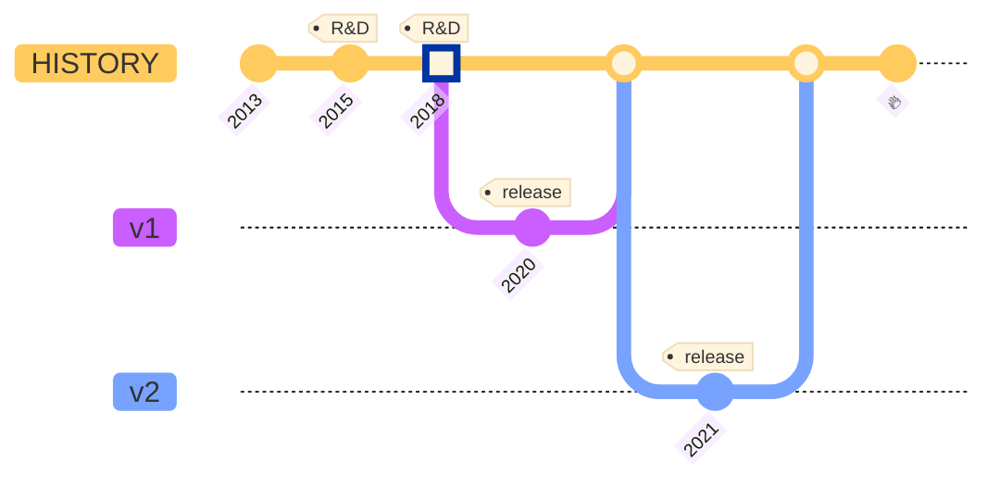

Waku v1 was a fork of Whisper with some added tweaks for efficiency. Waku v2 is a completely redesigned suite of protocols designed to address the goals set out [previously](/#motivation-and-goals).

### 2013

The introduction of the Ethereum White Paper marked the unveiling of the Holy Trinity, which comprises Ethereum for consensus, Swarm for decentralized storage, and Whisper for peer-to-peer messaging.

### 2015-2018

The development of the Whisper protocol lagged behind the advancements made by the Ethereum EVM and Swarm, primarily because there was no dedicated team working on building the protocol.

### 2018

Due to the lack of progress made on Whisper and growing concerns around scalability, Vac was established to focus on researching and developing more scalable peer-to-peer messaging solutions.

### 2020

Status introduced Waku v1 as its messaging protocol, which replaced Whisper.

### 2021

Waku v2 supersedes Waku v1.
