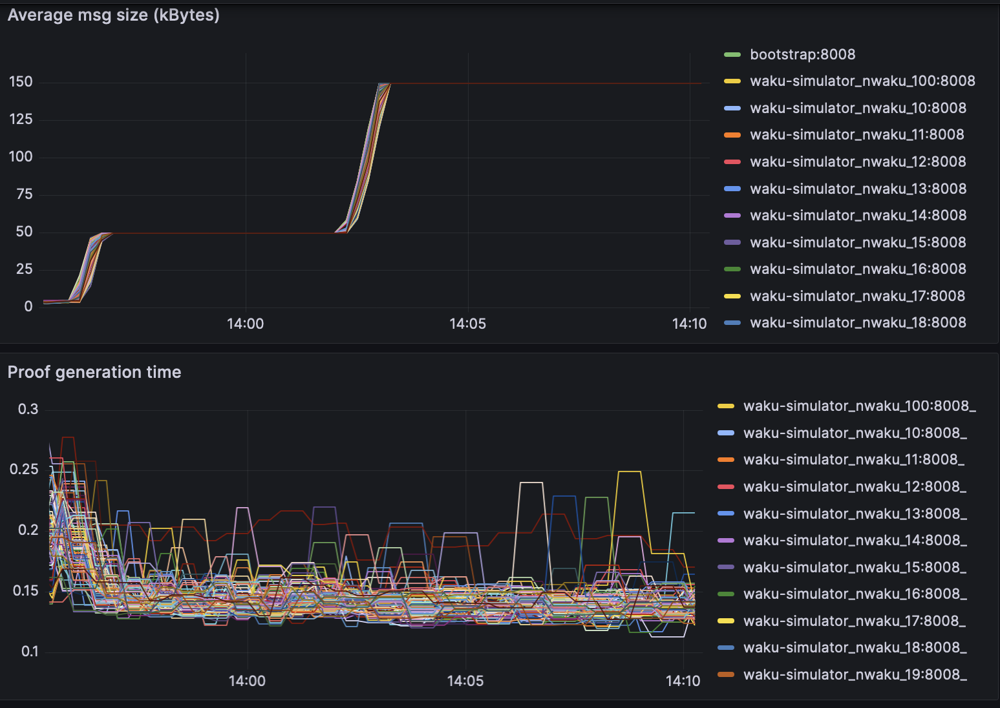
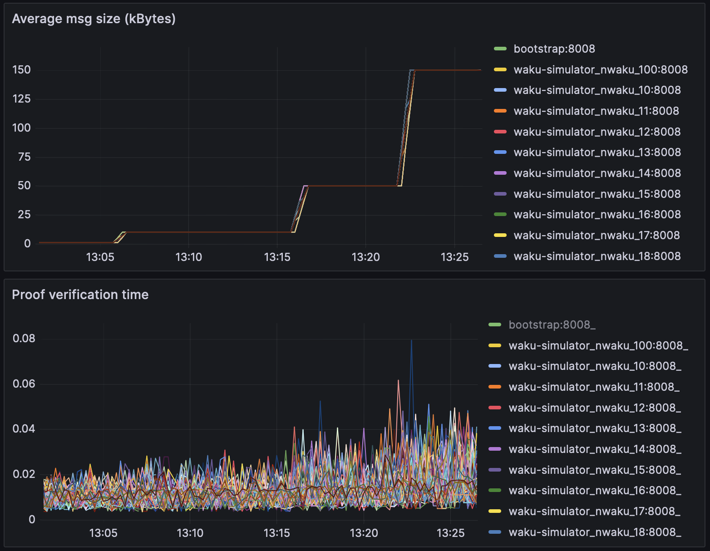
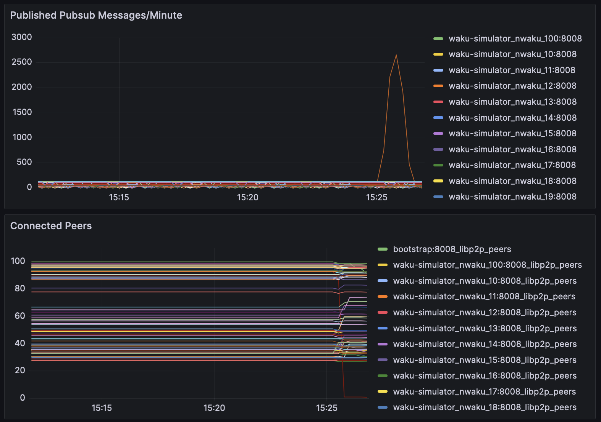

## Introduction

Since RLN has been chosen as the spamming protection mechanism for waku, we must understand the practical implications of using it. This issue explains the main differences between `relay` and `rln-relay` and gives some benchmarks after running simulations using `waku-simulator`, in a network with the following characteristics:

- 100 nwaku nodes, each one with a valid rln membership and publishing a message every 10 seconds to a common topic.
- rln contract deployed in Ethereum Sepolia
- 10.000 memberships registered in the contract
- pure relay (store and light protocols disabled)

The main deltas `rln` vs `rln-relay` are:

- New `proof ` field in `WakuMessage` containing 384 extra bytes. This field must be generated and attached to each message.
- New validator, that uses `proof` to `Accept` or `Reject` the message. The proof has to be verified.
- New dependency on a blockchain, Ethereum, or any EVM chain, to keep track of the members allowed to publish.

But what are the practical implications of these?

## TLDR:

- Proof generation is constant-ish. 0.15 second for each proof
- Proof verification is constant-ish, 0.012 seconds. In a network with 10k nodes and D=6 this would add an overhead delay of 0.06 seconds.
- Gossipsub scoring drops connections from spammer peers, which acts as the punishment (instead of slashing). Validated in the simulation.
- Rln doesn't have any impact on memory consumption.

## Proof generation times

Seems that proof generation times stay constant no matter the size of the message. In the following simulation it was increased from: `1kB`, `10kB`, `50kB`, `150kB`. On average it takes `0.15 seconds` to calculate the message proof. This means that when a node wants to send a message, it will need to spend this time generating the proof. It seems very reasonable and it actually acts as a mini proof of work, where a consumer computer won't be able to publish a really high number of messages per second.

## Proof verification times

On the other hand, rln also adds an overhead in the gossipsub validation process. On average it takes `0.012 seconds` to verify the proof. It seems that when we increase the message size, validation time seems to increase a bit, which can be for any other reason besides rln itself (eg deserializing the message might take longer).

This number seems reasonable and shouldn't affect that much the average delay of a message. Assuming a d-regular graph, with `10k` nodes and `D=6`, we can have up to `log(total_nodes)/log(D)=5` hops. So in the worst case, rln will add a network latency of `0.012*5 = 0.06 seconds`

## Spam protection

For the initial release of RLN, slashing won't be implemented and it still remains unclear if it will be implemented in the future. Luckily, even if slashing is not implemented rln can be used to detect spam and punish the sender off-chain (instead of slashing an onchain collateral). This is done with gossipsub scoring.

In the following simulation, we can see `100` nwaku interconnected nodes, where one of them suddenly starts spamming the network with multiple valid rln messages `3000 messages/minute`. Since its rate limited to 1msg/10 seconds, we can see that in almost no time, every node in the network disconnects from the spammer peer (see red node), leaving it with `0 peers`, which disincentivise such attacks and without requiring a financial slashing.

## RLN tree sync

Using RLN implies that waku should now piggyback on a blockchain (the case study uses Ethereum Sepolia) and has to stay up to date with the latest events emitted by the rln smart contract. These events are used to locally construct a tree that contains all members allowed to create valid proofs to send messages. Some numbers:

- A tree with 10k members takes `2Mbytes` of space. Negligible.
- A tree with 10k members takes `<4` minutes to synchronize. Assumable since it's done just once.
- With a block range of 5000 blocks for each request, we would need `520 requests` to synchronize 1 year of historical data from the tree. Assumable since most of the free endpoints out there allow 100k/day.

## Performance relay vs. rln-relay

Same simulation with 100 nodes was executed `with rln` and `without rln`:

- Memory consumption is almost identical

**with rln**

**without rln**

- Couldn't capture cpu metrics
- Minor differences in messages per seconds is due to injection technique, nothing related to rln itself.
