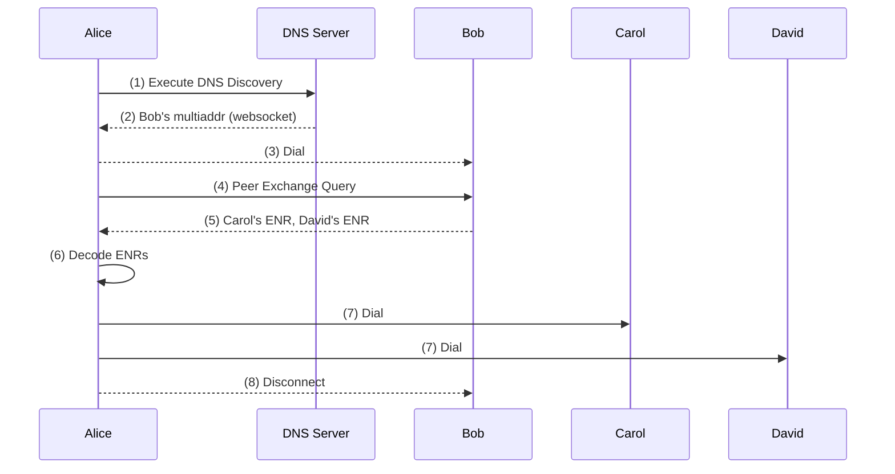

1. DNS Discovery protocol is executed.
2. Alice's retrieves Bob's websocket multiaddr from DNS Server.
3. Alice dials Bob using libp2p protocols.
4. Alice executes a Peer Exchange Query to Bob.
5. Bob returns Carol's and David's ENR to Alice.
6. Alice Decodes ENRs and extracts Carol's and David's websocket multiaddrs.
7. Alice dials Carol and David.
8. Alice can now drop the connection with Bob (bootstrap node), Alice has 2 connections to the Waku Network.
